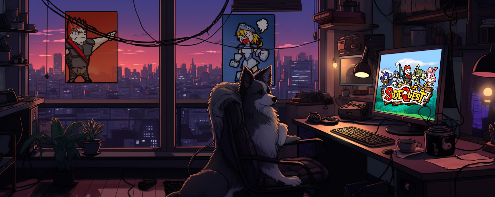
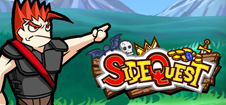
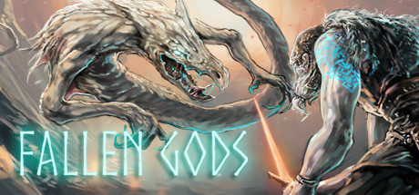
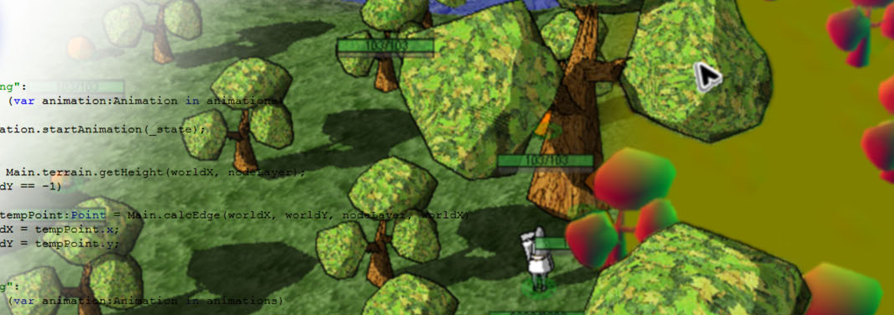

{width=640px}
 
Image generated by Midjourney.

 

 <h1>Game development</h1> 

 

{width=460px}

<h3 id="sidequest">SideQuest</h3>
<a href="https://store.steampowered.com/app/1711470/SideQuest_Reanimated/">Steam page</a>

SideQuest is a side-scrolling action RPG that takes you headfirst into a challenging adventure with a band of delightfully unconventional heroes. Play solo or with friends as you conquer quests, collect loot, craft devious custom builds, and press forward towards our heroes' inescapable destiny!

This project eats all my free time. I do all the game design, programming and producing.

 
 

{width=460px}

<h3 id="fallenGods">Fallen Gods</h3>

<a href="https://store.steampowered.com/app/1641190/Fallen_Gods/">Steam page</a>

Fallen Gods is a narrative “rogue-lite” RPG. You control the titular fallen god, who starts each game with different might, wits, health, and divine powers, and one of several animal familiars and magical artifacts.

I designed the main game engine. The bulk of the game takes place in events, which have a scripting layer I designed.

 
 

{width=460px}

<h3 id="sagoau">Direct X game engine test</h3>
Way back before Unreal and Unity I had a dream of making the next WoW killer. I designed a game engine in C++ and direct X from scratch, complete with networking, character classes and LUA based UI scripting. Sadly, this monstrosity of an engine never managed to kill WoW... oh well, there's always the next project!

