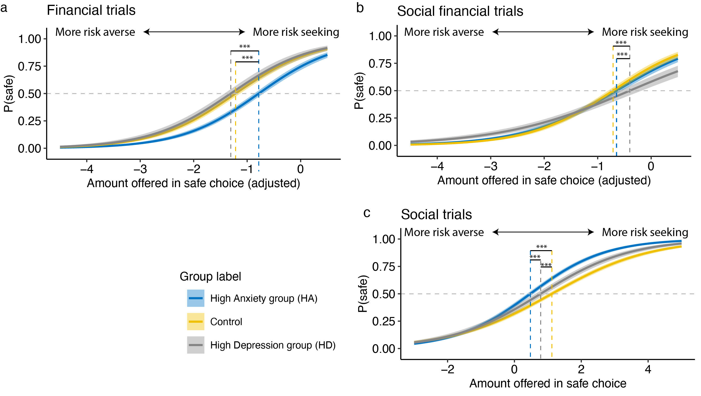

{width=640px}

 

 <h1>Research</h1> 

 

Humans yearn for deep social relationships, but connecting with people is a risky business: a friendly attempt to reach out to a stranger may be rejected, or an intimate confession of feelings could fall flat. My research program is centered on these __social risk behaviors__. 
 
 
I use a variety of research methods to approach this question at different levels (e.g., behavioral, social network, and brain, long and short time scales). 

 

### 1. Defining social risk taking.
 

One line of my research aims to advance a mechanistic understanding of social risk taking through quantitative modeling of behavioral and neuroimaging data. In one recent study ([preprint](https://osf.io/preprints/psyarxiv/8khry/)), I assessed social and financial risk taking in the same behavioral paradigm. I found that people with varying depression and anxiety levels demonstrated distinct behavioral patterns of risk taking across contexts. These results highlight that taking social risks involves unique processes compared to taking financial risks.

 
{width=640px}
 
__Figure 3.__ of [paper](https://osf.io/preprints/psyarxiv/8khry/) demonstrating distinct risk taking profiles as a function of anxiety and depression. Participants with high anxiety were most likely to take financial risks, where as participants with high depression were most likely to take risks in the social financial trials (i.e., investing money in a peer). When it comes to social risks (i.e., having a conversation with a stranger), both anxiety and depression groups were more risk averse compared to the control group.

 

### 2. Social risk taking, social networks and wellbeing
 
A second line of my research takes social risk taking from laboratory to the real world, and examines how individuals’ social risk tendencies are associated with their wellbeing and characteristics of their social worlds (e.g., social network position). Leveraging longitudinal data at different time scales (one year and daily) in a large college student sample, I found evidence for both short-term and long-term positive effects of social risk taking on individuals’ wellbeing and social network diversity. Importantly, by combining longitudinal data at different time scales, I found that the daily emotional benefit of taking social risks is critical in contributing to an overall increase in taking social risks. This line of work illustrates the potential benefit of taking social risks on the diversity of individuals’ social networks.
 
 

### 3. Social vs. health risk taking
 
A third line of my work focused on the relationships between social and health risk taking. Consider this scenario: when a teenager is pressured by their peer passengers to drive through a red light, running a light poses a health risk. However, it also serves to mitigate a social risk (stopping at the light), which could lead to the potential negative social outcomes such as being perceived as uncool by those friends. As such, in many cases, people may choose to take health risks to avoid taking social risks. My work in this area emphasized the central role of social context adolescent health risk taking (e.g., smoking, risky driving). Specifically, I (1) examined the neuropsychological processes underlying peer influence in a driving context ([Pei et al., 2020](https://www.sciencedirect.com/science/article/pii/S1878929320300426)), and (2) investigated the moderating roles of age and cultural contexts in social influence and conformity ([Pei et al., 2023](https://compass.onlinelibrary.wiley.com/doi/10.1111/spc3.12908); Pei et al., under review). 
 
 
