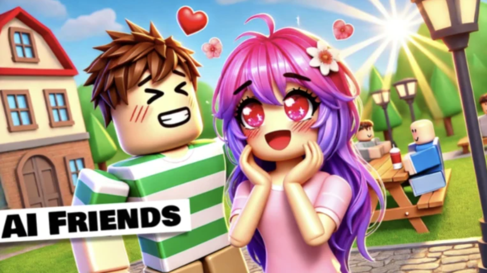

```{=html}
<style type="text/css">
  body{
  font-size: 13pt;
}
</style>
```
<center>

::: {style="display: inline-block; text-align: right"}
{width="640px"} <br> <font size="-2">Image generated by Midjourney.</font>
:::

</center>

<br>

<center>

<h1>Game development</h1>

</center>

<br>

<div>

::: {style="float: right;margin-left: 20px;"}
{width="460px"}
:::

<h3 id="chatterblox">

Chatterblox

</h3>

<a href="https://www.roblox.com/games/18951076642/Chatterblox-ChatGPT-AI-Friends">Roblox page</a>

With Chatterblox you can talk to your favorite characters in an embodied 3D world! The more you chat the deeper your relationship becomes. If you get bored of chatting you can also play our scenarios. You and the pilot are the only surviors of a plane crash... hunger is setting in... who will eat who to survive?

</div>

<br><br>

<div>

::: {style="float: left;margin-right: 20px;"}
{width="460px"}
:::

<h3 id="sidequest">

SideQuest

</h3>

<a href="https://store.steampowered.com/app/1711470/SideQuest_Reanimated/">Steam page</a>

SideQuest is a side-scrolling action RPG that takes you headfirst into a challenging adventure with a band of delightfully unconventional heroes. Play solo or with friends as you conquer quests, collect loot, craft devious custom builds, and press forward towards our heroes' inescapable destiny!

This project eats all my free time. I do all the game design, programming and producing. The game is fully online with both server and a peer to peer play support. It features 5 playable classes with unique skill kits and customization options. Hundreds of enemies, thousands of items, 12 epic boss fights and over 40 quests each with their own unique mechanics (ranging from simple modifications to combat, to full fledged minigames).

</div>

<br> <br>

<div>

::: {style="float: right;margin-left: 20px;"}
{width="460px"}
:::

<h3 id="fallenGods">

Fallen Gods

</h3>

<a href="https://store.steampowered.com/app/1641190/Fallen_Gods/">Steam page</a>

Fallen Gods is a narrative “rogue-lite” RPG. You control the titular fallen god, who starts each game with different might, wits, health, and divine powers, and one of several animal familiars and magical artifacts.

I designed the main game engine. The bulk of the game takes place in events, which have a scripting layer I designed.

</div>

<br> <br>

<div>

::: {style="float: left;margin-right: 20px;"}
{width="460px"}
:::

<h3 id="sagoau">

Direct X game engine test

</h3>

Way back before Unreal and Unity I had a dream of making the next WoW killer. I designed a game engine in C++ and direct X from scratch, complete with networking, character classes and LUA based UI scripting. Sadly, this monstrosity of an engine never managed to kill WoW... oh well, there's always the next project!

</div>
