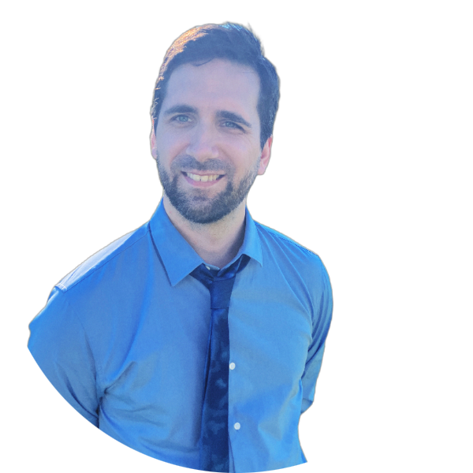

 
 
 

{width=140px}

__Connect with me__
 
sharnik at hotmail.com  
[{width=30px}](https://github.com/con-bren)
[{width=30px}](https://scholar.google.com/citations?user=asa20tUAAAAJ&hl=en&oi=ao)

 

__Related links__ 

[Autonomous AI at Mila](https://www.irina-lab.ai/about/) 

__Resumes__ 

[Machine Learning Researcher Resume](files/Machine Learning Resume.pdf) 
[Game Developer Resume](files/Game Engineer Resume.pdf) 

I am a postdoctoral scholar at the Machine Learning and AI institute, Mila. I recieved my Ph. D. in Neuroscience from the University of Pennsylvania and hold a B.S. in Physics from the University of Washington. I am interested in understanding the mechanisms that allow intelligent systems (for example, biological brains and artificial neural networks) to behave adaptively in the environments they have been selected for.

 

During grad school, this meant studying how living and artificial systems performed the necessary computations to react and adapt to their environments. My Thesis focused on using Dynamical Systems Theory to understand the way information flows about the brain.

 

In my postdoc, I'm taking a more direct approach by training large models in carefully constructed artificial environments that force them to learn to be adaptive. This boils down mostly to building custom RL environments and developing high performance computing solutions on some of the biggest super computers in the US.

 

When I'm not trying to create the singularity, I spend most of my time doing game development. This is my first passion. Fresh out of college I spent 3 years in the game industry before returning to academia. I hope someday to be able to combine both my academic studies and game development into one super awesome project!
 
 

 
 
 
 

