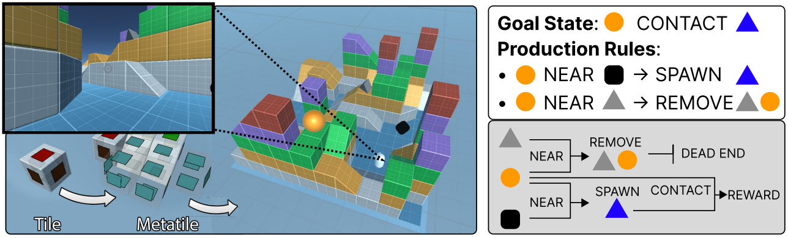

{width=640px}
 
Image generated by Midjourney.

 

 <h1>Machine learning & AI</h1> 

 

<h3>Publications</h3>
::: {style="float: left;margin-right: 20px;"}
{width="460px"}
:::

[United Unity Universe](https://openreview.net/forum?id=NTkUXqDvlg#discussion) (U3)

DeepMind showed that using a procedurally generated smooth task landscape is sufficient to endow agents with the ability to understand their environment in such a way that they are able to form hypotheses, test those hypotheses, and ultimately capitalize on the results. This could be a major breakthrough for AI sentience research. This paper is the first step in bringing that work to the open-source domain.

 

<h3>Motivation</h3>
My goal is to create artificial agents that are able to learn and adapt to novel environments on the fly. The following projects are all in service of that goal.

 

<h3>Foundation models and LLMs</h3>
I am involved with several projects at Mila and on the OLCF super computers. 

<b>Multimodal models.</b> We are interested in extending the recent success of Large Language Models (LLMs) to other modalities, and to domains with increased context length. To this end, we are currently working on projects focused on training generative transformers on SUMMIT and FRONTIERS super computers that are capable of handling not only test input, but also images, videos, reinforcement learning (RL) trajectories and audio. We hope that training on multiple modalities at once will allow cross domain transfer and allow some of the impressive generalization capabilities seen in LLMs to appear in other domains as well.

<b>Video pretraining.</b> We are attempting to build foundation models for RL. The idea is that by training a network on offline RL data we can produce a network that is able to be quickly fine tuned to a specific reward structure in down stream RL. We hope that by applying this approach to many games at once we can produce a network that is well situated to quickly adapt to a variety of RL environments, including real-life robotics.

<b>Memory augmented LLMs.</b> This project focuses on increasing the context length of transformers by using working memory. Inspired by my work in <a href="./research.html#workingMemory">neuroscience</a>, we believe that by compressing the current context into a memory representation networks will be able to make use of past experiences to inform their current context

 

<h3>Reinforcement learning</h3>
Large models need large data. We are already starting to run out of available language data, but RL environments offer a way to generate infinite and hugely rich datasets.

<b>Adaptive agents through memory.</b> We are training agents in an end-to-end fashion to achieve meta-learning. Small scale experiments are being performed in a custom designed minigrid environment. We hope to eventually apply the techniques we learn here to more complex 3D environments.

<b>Open Source RL environment ecosystem.</b> This <a href="https://github.com/AGI-Collective/u3">United Unity Universe (U3)</a> is meant to be a tool for quickly prototyping new RL environments, complete with procedural generation, support for modern day training techniques and huge amounts of assets through the Unity asset store. Our first experiment with this system is to train an adaptive agent by using memory augmented networks to facilitate meta-learning. 

<b>Distributed training.</b> A primary challenge for RL experimentation is setting up high performance training environments. Most of the existing systems focus on the training of LLMs, and many optimizations maybe for those systems perclude the ability to training RL agents. We hope to develop an environment for training RL agents on super computer clusters such as SUMMIT or FRONTIER.

