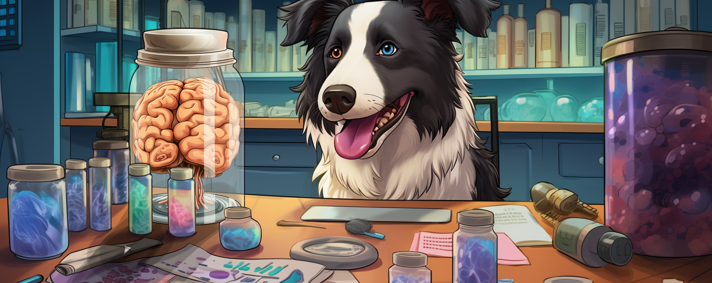

{width=640px}
 
Image generated by Midjourney.

 <h1>Neuroscience Research</h1> 

<a href="#worms">
{height=100px}
</a>
<a href="#looper">
{height=100px}
</a>
<a href="#workingMemory">
{height=100px}
</a>
<a href="#playGames">
{height=100px}
</a>

 
 

<h3 id="playGames">How do machines play games?</h3>
There is a long history of artificial intelligence going circuit board to head with professional game players. Starting with Chess and recently Go, board games have been fully dominated by AI. Recently, even live action video games such as DOTA2 and Starcraft 2 have fallen to the reign of the machine. Yet, there remain many weaknesses in these artificial agents: they take may lifetimes to train, and only play a single game. We seek to use the rising field of dynamics in intelligent systems to understand how these machines perform the computations necessary to perform at super-human levels on their game of choice. How do the strategies enacted by such agents compare to those enacted by humans? 

We study this question by exploring the dynamics present in artifical agents trained to solve simple tasks. A agent learns to navigate an arena in a circular search pattern. That search pattern is embodied by the dynamics of the network (Cyan is move up, Blue is move right, Yellow is move down and Green is move left). Interestingly, these dynamics are driven by the agent's interaction with its environment, and so the dynamics never reach the fixed points in the middle of the ring (marked by Xs).

{width=300px}

 
 

<h3 id="workingMemory">A simple model of working memory</h3>
Working memory is an essential requirement for most human cognitive processes. There has been some success in modeling working memory using discrete attractor systems, but these models were only tested on a few time points. We desgined an experiment to test working memory dynamics over a full time course of decay. We found that a simple model of Brownian motion on an energy landscape is insufficient. However, we were able to rescue the model by adding a simple Gasussian plasticity term. Intriguingly, we find that error-correcting properties of discrete attractor systems are no longer required when using plastic models; yet the brain seems to make use of them anyway.

{width=500px}

 
 

<h3 id="looper">LOOPER: a tool for extracting simple and interpretable models from experimentally observed neuronal activity traces.</h3>
The properties of artificial networks that facilitate computation can be inferred by applying linear stability analysis. This is not possible in biological systems as we cannot know the full equations of motion. LOOPER attempts to rectify this problem by grouping similar trajectories of the observed neuronal activity into clusters. These clusters, which we refer to as loops, correspond to consistent patterns of activation in the system -- and thus represent some conserved computational information. The structure of branching pattern of the loops is a topological description of the dynamics that embodies the same information as standard linear stability analysis. We find that while monkey brains and neural networks exhibit distinct patterns of neuronal activity, this topological description is conserved when the systems are engaged in the same task.

{width=500px}

 
 

<h3 id="worms">Modeling <i>C. elegans</i> nervous system.</h3>
Application of LOOPER-like analysis to nematode <i>C. elegans</i> results in a model of nervous system dynamics that allows for predictions of future animal behaviors. Surprisingly, this prediction is valid across animals observed years apart, and requires abstracting away from the raw neuronal activity to consider the overall network dynamics.

{width=500px}

 
 
